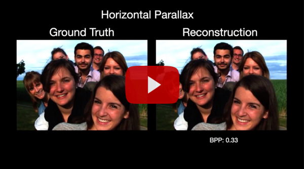

# LFCAE

### Parallax comparison between ground truth Light Field Images and Reconstructions from Proposed Learning-based Compression Model 

# LFCAE

### Parallax comparison between ground truth Light Field Images and Reconstructions from Proposed Learning-based Compression Model 

  |  

### (click below to redirect to youtube)

### Test images used:

